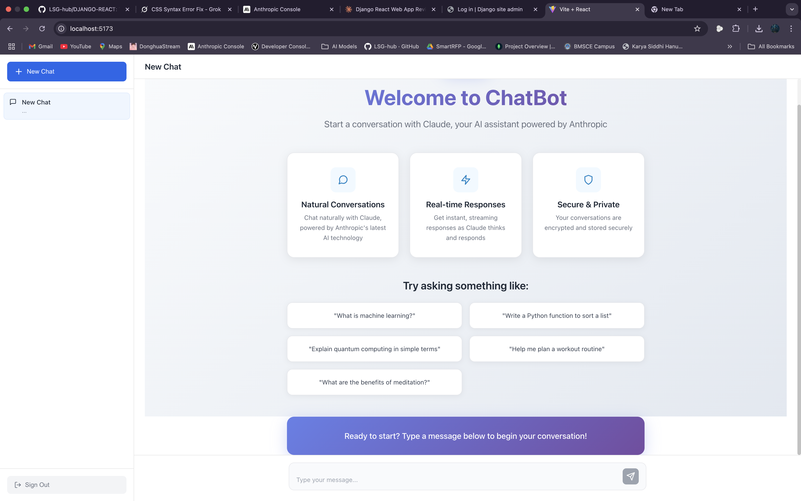

# 🤖 Claude-Like Chatbot

A modern, full-stack chatbot application inspired by Claude AI, built with Django REST Framework and React. This application provides a seamless chat experience with user authentication, conversation persistence, and real-time AI responses powered by Anthropic's Claude API.



## ✨ Features

- **🔐 User Authentication**: Secure JWT-based registration and login system
- **💬 Real-time Chat**: Instant messaging with Claude AI responses
- **📚 Conversation History**: Persistent chat storage with sidebar navigation
- **🎨 Modern UI**: Beautiful, responsive interface inspired by Claude's design
- **🔒 Secure**: Environment-based configuration with proper authentication
- **🐳 Dockerized**: Complete containerization for easy deployment
- **📱 Responsive**: Works seamlessly on desktop, tablet, and mobile devices
- **🚀 Fast**: Optimized performance with React and Django

## 🛠️ Tech Stack

### Frontend
- **React 18** - Modern UI library with hooks
- **React Router** - Client-side routing
- **Axios** - HTTP client for API calls
- **Lucide React** - Beautiful icons
- **Vite** - Fast build tool and dev server

### Backend
- **Django 5.2** - Robust Python web framework
- **Django REST Framework** - Powerful API toolkit
- **JWT Authentication** - Secure token-based auth
- **SQLite** - Local database (easily upgradeable to PostgreSQL/MongoDB)
- **Anthropic API** - Claude AI integration

### DevOps
- **Docker & Docker Compose** - Containerization
- **Environment Variables** - Secure configuration management
- **Hot Reload** - Development-friendly setup

## 🚀 Quick Start

### Prerequisites

- **Docker** and **Docker Compose** installed
- **Anthropic API Key** (get one from [Anthropic Console](https://console.anthropic.com/))

### Installation

1. **Clone the repository**
   ```bash
   git clone <your-repo-url>
   cd DJANGO-REACT
   ```

2. **Set up environment variables**
   
   Create a `.env` file in the project root:
   ```bash
   # Replace with your actual Anthropic API key
   ANTHROPIC_API_KEY=your-anthropic-api-key-here
   ```

   Create `backend/.env`:
   ```bash
   SECRET_KEY=your-django-security-key-here
   DEBUG=True
   ANTHROPIC_API_KEY=your-anthropic-api-key-here
   ```

3. **Start the application**
   ```bash
   # Build and start all services
   make start
   
   # Or use Docker Compose directly
   docker-compose up --build
   ```

4. **Access the application**
   - **Frontend**: http://localhost:5173
   - **Backend API**: http://localhost:8000
   - **Django Admin**: http://localhost:8000/admin

## 📖 Usage

### First Time Setup

1. **Register a new account** at http://localhost:5173/register
2. **Login** with your credentials
3. **Start chatting** by clicking "New Chat" or typing a message

### Available Commands

```bash
# Start all services
make start

# View logs
make logs

# Stop all services
make down

# Clean and restart
make clean
make start

# Access backend container
make shell-backend

# Access frontend container
make shell-frontend
```

## 🏗️ Project Structure

```
DJANGO-REACT/
├── 📁 backend/                 # Django backend
│   ├── 📁 api/                # Main API app
│   │   ├── 📁 services/       # Business logic services
│   │   │   └── anthropic_service.py
│   │   ├── models.py          # Database models
│   │   ├── serializers.py     # API serializers
│   │   ├── views.py           # API views
│   │   └── urls.py            # URL routing
│   ├── 📁 backend/            # Django settings
│   ├── requirements.txt       # Python dependencies
│   ├── Dockerfile            # Backend container config
│   └── manage.py             # Django management
├── 📁 frontend/               # React frontend
│   ├── 📁 src/               # Source code
│   │   ├── 📁 components/    # Reusable components
│   │   ├── 📁 pages/         # Page components
│   │   ├── 📁 styles/        # CSS files
│   │   ├── App.jsx           # Main app component
│   │   └── main.jsx          # Entry point
│   ├── package.json          # Node dependencies
│   └── Dockerfile           # Frontend container config
├── docker-compose.yml        # Multi-container orchestration
├── Makefile                 # Development commands
├── .env                     # Environment variables
├── .gitignore              # Git ignore rules
└── README.md               # This file
```

## 🔧 Configuration

### Environment Variables

| Variable | Description | Required |
|----------|-------------|----------|
| `ANTHROPIC_API_KEY` | Your Anthropic API key for Claude | ✅ Yes |
| `SECRET_KEY` | Django secret key | ✅ Yes |
| `DEBUG` | Django debug mode | No (default: True) |

### API Endpoints

| Endpoint | Method | Description |
|----------|--------|-------------|
| `/api/user/register/` | POST | User registration |
| `/api/token/` | POST | User login |
| `/api/chats/` | GET, POST | List/create chats |
| `/api/chats/{id}/` | GET, PUT, DELETE | Chat details |
| `/api/chats/{id}/messages/` | GET | Chat messages |
| `/api/chats/{id}/send/` | POST | Send message |

## 🎨 Features in Detail

### Authentication System
- **Secure Registration**: Email and username validation
- **JWT Tokens**: Access and refresh token system
- **Protected Routes**: Automatic authentication checks
- **Session Persistence**: Remember login across browser sessions

### Chat Interface
- **Welcome Screen**: Beautiful onboarding experience
- **Sidebar Navigation**: Easy access to all conversations
- **Message History**: Persistent conversation storage
- **Real-time Updates**: Instant message delivery
- **Responsive Design**: Works on all screen sizes

### AI Integration
- **Claude API**: Latest Claude 3.5 Sonnet model
- **Error Handling**: Graceful fallbacks for API issues
- **Message Formatting**: Proper conversation context
- **Response Streaming**: Real-time message delivery

## 🚧 Development

### Running in Development Mode

1. **Backend Development**
   ```bash
   cd backend
   python manage.py runserver
   ```

2. **Frontend Development**
   ```bash
   cd frontend
   npm run dev
   ```

### Adding New Features

1. **Backend Changes**: Modify models, views, or add new endpoints
2. **Frontend Changes**: Add new components or pages
3. **Database Changes**: Create migrations with `python manage.py makemigrations`

## 📝 API Documentation

The API follows REST conventions and returns JSON responses.

### Authentication
All protected endpoints require a Bearer token in the Authorization header:
```
Authorization: Bearer <your-jwt-token>
```

### Example Requests

**Register User:**
```bash
curl -X POST http://localhost:8000/api/user/register/ \
  -H "Content-Type: application/json" \
  -d '{"username": "testuser", "email": "test@example.com", "password": "password123"}'
```

**Send Message:**
```bash
curl -X POST http://localhost:8000/api/chats/{chat_id}/send/ \
  -H "Authorization: Bearer <token>" \
  -H "Content-Type: application/json" \
  -d '{"message": "Hello Claude!"}'
```

## 🐳 Docker Configuration

The application uses multi-stage Docker builds for optimization:

- **Backend**: Python 3.11 slim with Django and dependencies
- **Frontend**: Node.js 18 Alpine with React and Vite
- **Volumes**: Persistent data storage for development
- **Networks**: Isolated container communication

## 🔒 Security Features

- **JWT Authentication**: Secure token-based authentication
- **CORS Protection**: Configured for frontend-backend communication
- **Environment Variables**: Sensitive data in environment files
- **Input Validation**: Server-side validation for all inputs
- **Error Handling**: Secure error messages without data leakage

## 🚀 Deployment

### Production Deployment

1. **Set environment variables**:
   ```bash
   DEBUG=False
   ANTHROPIC_API_KEY=your-production-key
   ```

2. **Use production database** (PostgreSQL recommended):
   ```python
   # In settings.py
   DATABASES = {
       'default': {
           'ENGINE': 'django.db.backends.postgresql',
           'NAME': 'your_db_name',
           'USER': 'your_db_user',
           'PASSWORD': 'your_db_password',
           'HOST': 'your_db_host',
           'PORT': '5432',
       }
   }
   ```

3. **Deploy with Docker Compose**:
   ```bash
   docker-compose -f docker-compose.prod.yml up -d
   ```

## 🤝 Contributing

1. Fork the repository
2. Create a feature branch (`git checkout -b feature/amazing-feature`)
3. Commit your changes (`git commit -m 'Add amazing feature'`)
4. Push to the branch (`git push origin feature/amazing-feature`)
5. Open a Pull Request

## 📄 License

This project is licensed under the MIT License - see the [LICENSE](LICENSE) file for details.

## 🙏 Acknowledgments

- **Anthropic** for the Claude API
- **Django** and **React** communities
- **Docker** for containerization
- **Vite** for the amazing development experience

## 📞 Support

If you encounter any issues or have questions:

1. Check the [Issues](../../issues) page
2. Create a new issue with detailed information
3. Include error logs and environment details

---

**Happy Chatting!** 🎉

Built with ❤️ using Django, React, and Claude AI.